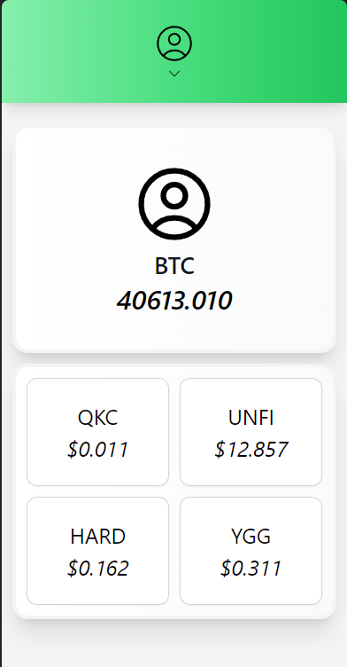
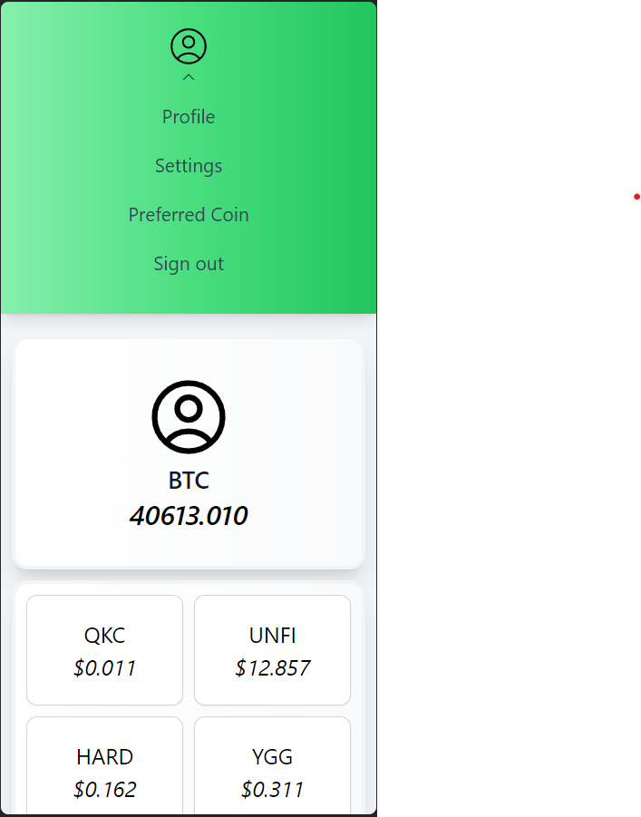
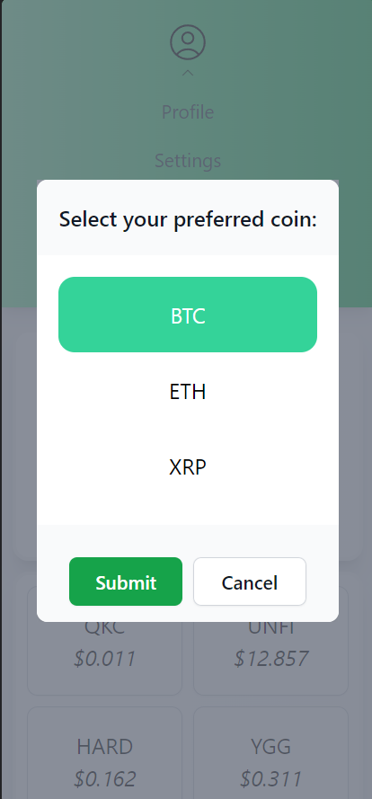
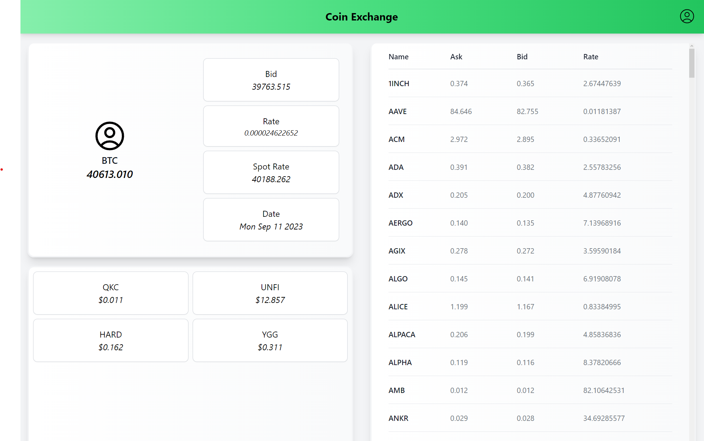
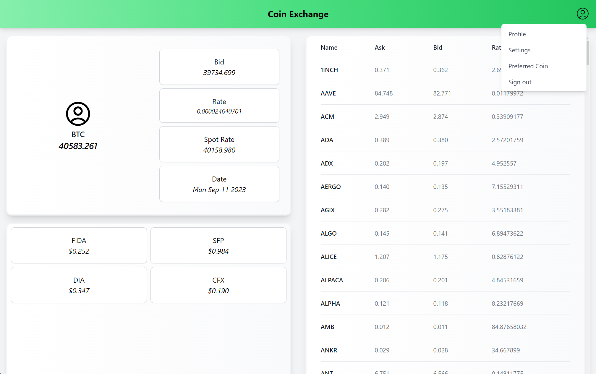
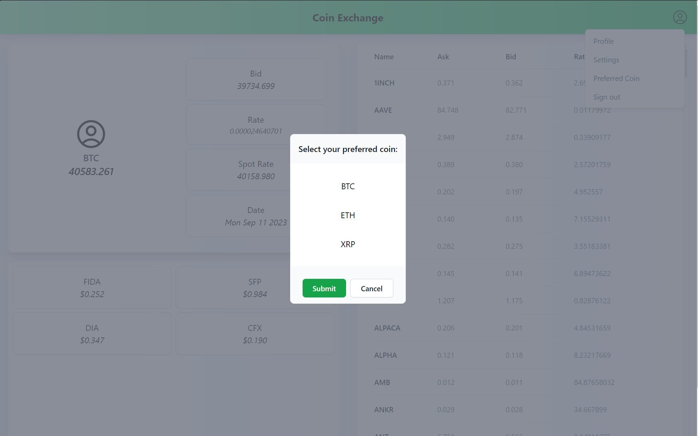

# Cointree code challenge

## Deployed on https://code-challenge-six.vercel.app/

## Instructions
> 1. git clone git@github.com:dlim28/code-challenge.git  
> 2. cd code-challenge  
> 3. npm install 
> 4. npm run dev  
> 5. Enjoy!

# Design and Approach
Since I have opted for the use of tailwind and the svelte framework I started off with a mobile design first since tailwind is a mobile
first design framework  
[Wireframe](https://excalidraw.com/#json=TzByOI4kRbRoPcyrjmDCP,nD3vU9n9BCfcFvTrB7SPlw)

As far as I understand the scope of the challenge is to display your selected preferred coin and show the ask price  

## Mobile
With a mobile first design it was easy to make use of a small screen real estate and display the card as well as some other data that came along with the coin  
The first card is to showcase the preferred coin that is stored on the localStorage on the browser. If there are no preferences then it will default to BTC.  
The second card is to show the remaining data that was not asked but relevant to the information of the preferred coin  
  
To select the preferred coin,there is an icon of a user profile with a chevron that indicates that a menu can be toggled. This sits on top of the screen as a navigation bar.  
When the preferred coin menu option is selected a dialog will appear and you can select the preferred coin (BTC, ETH, XRP)  
Once the preferred coin is selected it will be stored in the localStorage where it will persist
  
### Things i'd like to do if I had some more time (mobile)
* Better design of the menu
  * Currently it is an expansion of the navbar, I believe it should be separate and floating in top of the cards rather than moving the entire body down
* Add icons for the preferred coin
  * Currently it is a placeholder (using the profile icon). Ideally I would like an API that serves icons
* Skeleton loading placeholders when changing preferred coins

## Desktop/Tablet view
This was a little more difficult to figure out as the scope is still the same (showing a preferred coin with the name and ask price) but the screen is much larger.  
Having the same set of cards to just showcase the same data was a waste of space. Conventionally people who use larger screens will look at data differently and
they will tend to focus more at different parts of the screen  
The api given provides a list of all coins on the exchange *(I believe)* if you do not specify a specific coin, so I used that to create a table on half of the screen 

The other half of the screen was the same card however all the related data was put into one card. It was a more effective use of space than a mobile screen  
The problem is now the bottom half of the card had nothing and having half the screen to take up just the preferred card slot is a big use of space  
I honestly did not know what to put there so I made a 'recommended coin' function to randomly select coins from the entire list of coins. I only put in 4 for now  
Realistically this may be its own API and potentially showcase a users habits and purchases and it may suggest certain coins based user behaviour  
Another use for this space could be trending coins that the API would want to showcase, but things like trends can also be highlighted on the table  

The menu to select a preferred coin is slightly different on the desktop view. It will popup a menu on the side and then open up a dialog for you to select the preferred coin 
  
I believe dialogs are pretty ubiquitous on both mobile and desktop design. What they do is allow the user to focus on important actions. In this case its to select a preferred coin
Once selected, just like the mobile view, it will be stored on localStorage and persist until the app data is cleared  
### Things i'd like to do if I had some more time (desktop)
* Currently the table has all the coins called from the API
  * I would have preferred a paginated API so I can get smaller results (I probably should have asked if there was one!)
    * If there wasn't a paginated API I believe you can store the results in the svelte store and have it sorted in blocks (lets say 10-20 coins) and when requesting the next page of results simply just index the array of results
    * The table view is a great source of overviewed data and having something like a history to show price differences would allow people to quickly view and interpret the data quickly
      * I would probably color code the differences (such as red for loss, green for gains)
        * Having that nuance of color will allow users to quickly grasp data on a large device
* Just like the mobile view, I would like to add icons for the preferred coin at least
  * Ideally all coins on the table and the recommended should have icons. It adds color and vibrancy to an otherwise drab page

## Things i'd like to do if I had more time (overall)
* Write some unit tests - probably a weak point for me
* Add proper error handling
  * In svelte having the await blocks are useful when dealing with promises. However currently they just show some text while pending and when something goes wrong
  * Ideally I would prefer to have the cards styled to show an error (rather than the page show the error)
* Each card should have a refresh button to asynchronously refresh data rather than having the user refresh the whole page
* Handle bad routing
  * Currently it breaks the page, sveltekit does have a way to handle [this](https://kit.svelte.dev/docs/errors)
* Work on animations
  * In both desktop and mobile views there should be some animations or transitions to show users where to point their attention.
    * This is mainly more of a desktop UX as they are on larger screens where information can overload a user
* Have a better color palette. I didn't realise that there was a [mediakit](https://www.cointree.com/company/media-kit/) until I was writing this